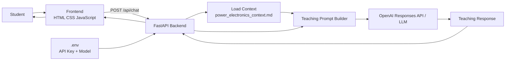

# System Architecture and Block Diagram

## High-level block diagram



## Component responsibilities

### 1. Frontend

The browser provides:

- Chat interface
- Learning mode selector
- Difficulty selector
- Example question buttons
- Conversation display

### 2. FastAPI backend

The backend:

- Validates requests.
- Loads the Markdown context.
- Builds the teaching prompt.
- Sends the request to the LLM.
- Returns the generated teaching response.

### 3. Context file

`context/power_electronics_context.md` contains:

- Subject knowledge
- Important equations
- Teaching sequence
- Common misconceptions
- Response style
- Safety/accuracy rules

### 4. LLM

The LLM converts the student's question + context + conversation into a teaching response.

### 5. Environment configuration

`.env` stores:

- `OPENAI_API_KEY`
- `OPENAI_MODEL`
- host/port configuration

The API key is never hard-coded in Python or JavaScript.

## Request flow

```text
Student
  ↓
Frontend
  ↓
POST /api/chat
  ↓
FastAPI
  ↓
Read context Markdown
  ↓
Build teaching instructions
  ↓
OpenAI Responses API
  ↓
Generated teaching answer
  ↓
FastAPI JSON response
  ↓
Frontend
  ↓
Student
```

## Why this is a teaching agent

A generic chatbot may simply answer:

> "A buck converter reduces DC voltage."

This project instructs the model to teach:

1. Start with intuition.
2. Explain the switching action.
3. Introduce duty cycle.
4. Give the ideal equation.
5. Work through a small example.
6. Mention a practical limitation.
7. Ask a check-for-understanding question.
8. Suggest the next topic.

That behavior is defined in the subject context file and the backend teaching prompt.


## Dual-LLM architecture

The `.env` file controls the provider:

```text
MODEL_PROVIDER=local
```

or:

```text
MODEL_PROVIDER=openai
```

For local mode:

```text
Frontend
   ↓
FastAPI
   ↓
Context Markdown
   ↓
Teaching Prompt
   ↓
Hugging Face Transformers
   ↓
Google Gemma 3 1B (local)
   ↓
Response
```

For cloud mode:

```text
Frontend
   ↓
FastAPI
   ↓
Context Markdown
   ↓
Teaching Prompt
   ↓
OpenAI Responses API
   ↓
Response
```

This gives the project a genuine local-model option while keeping the same
student interface and teaching context.
